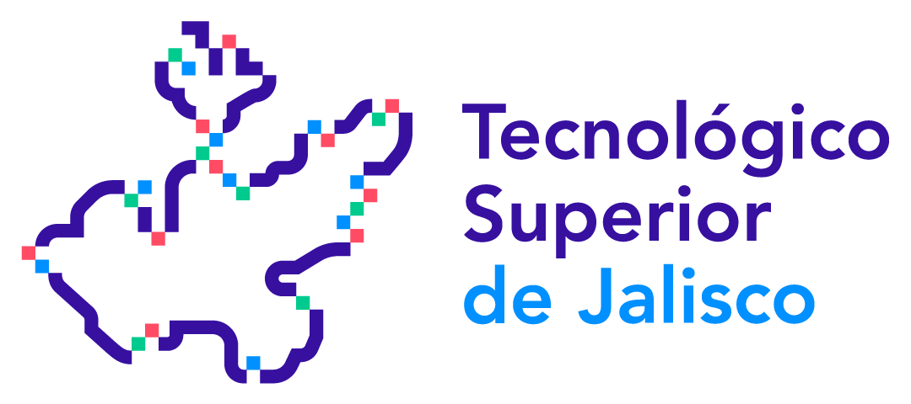

# Tovar-Reyes-Juan-De-Jesus-CV.github.io

# CV Juan de Jesus Tovar Reyes

## Resumen

Soy un(a) Ingeniero en sistemas computacionales con experiencia en el campo de base de datos. Me especializo en creacion y manejo de bases de datos, y he trabajado en breve proyectos sobre crear nuevos sistemas para ciertas empresas. Mi enfoque se centra en hacer un trabajo justo entre yo y la empresa y acpetando tratos justos como tambien para el cliente.

## Educación

### Tecnologico Superior de Jalisco - Ingeniero en Sistemas (Año de Graduación)

- Conocimientos de Calculo integral y diferencial.
- Cursos de Lenguajes aprendidos como Python, Java, C, C++.
- Cursos de Manejo de Gestores de base de datos SQL server, MySQL, Oracle.

## Habilidades

- Lenguajes de programacion en Python, Java, C, C++.
- Manejo en DB como MySQL, SQL server, Oracle.
- Conocimientos basicos en calculo Integral y Diferencial.

## Contacto

- Correo: za210110162@zapopan.tecmm.edu.mx
- Contacto Tel: 33 1824 5295

## Idiomas

- Ingles Nivel Intermedio.

## Certificaciones

- Ingeniero en Sistemas Computacionales.

